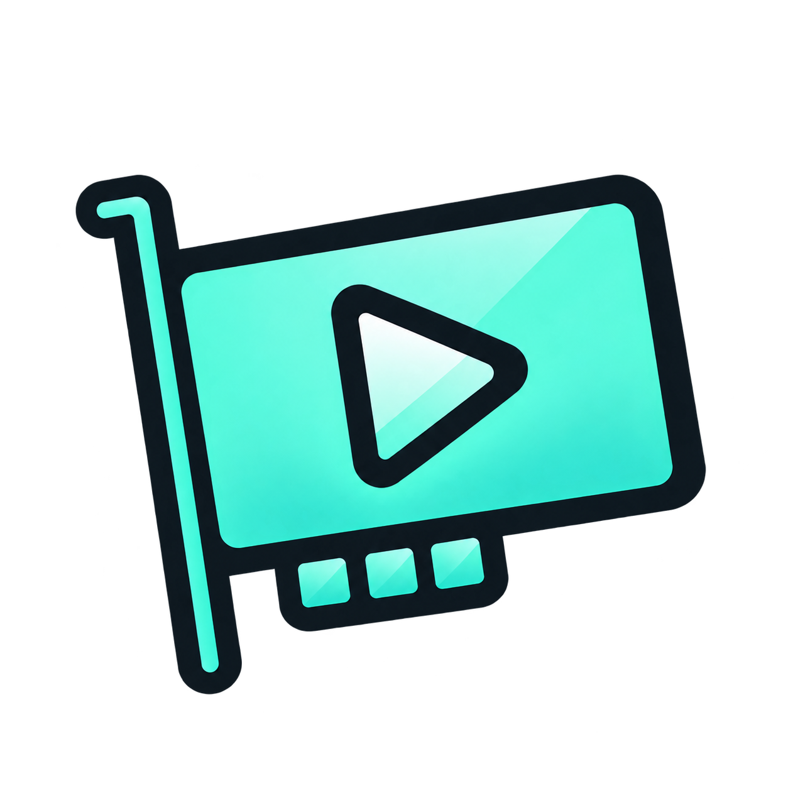

<p align="center">
  
</p>

# Dayaah Capture

[English](README.md) · **Español**

Vista previa nativa y de latencia ultrabaja para capturadoras HDMI en Windows
10/11 x64.

Dayaah Capture recibe video crudo directamente desde una capturadora
compatible, conserva únicamente el cuadro más reciente y lo presenta mediante
D3D11. El audio de la capturadora se reproduce por WASAPI dentro del mismo
proceso. No necesita MPV, FFmpeg, instalador, cuentas ni servicios en segundo
plano.

La versión estable actual es la **v1.1.3**.

## Características

- Captura nativa mediante Windows Media Foundation.
- Video crudo NV12 y YUY2, sin recompresión.
- Conversión de color y escalado con D3D11 Video Processor.
- Hilo de render dedicado y separado de la interfaz de la ventana.
- Cola limitada al cuadro más reciente para impedir que se acumule latencia.
- Modo de presentación de latencia mínima con tearing permitido.
- VSync opcional con una cola máxima de un cuadro.
- Captura y reproducción de audio WASAPI dentro del mismo proceso.
- Amplificación seleccionable: 0, +6, +12, +15 o +18 dB.
- Detección automática de dispositivos, resoluciones, FPS y formatos.
- Pantalla completa, silencio rápido y ocultamiento confiable del cursor.
- Configuración local en un archivo INI que recuerda las últimas opciones.

## Descargar y usar

1. Abre el [último lanzamiento](https://github.com/dayitaah/Dayaah-Capture/releases/latest).
2. Descarga el ZIP para Windows x64.
3. Extrae la carpeta completa.
4. Ejecuta `DayaahCapture.exe`.
5. Selecciona la capturadora, el modo de video, la entrada de audio, la
   amplificación y el modo de presentación.
6. Pulsa **INICIAR CAPTURA**.

Configuración inicial recomendada para la UGREEN 25173:

```text
1920 x 1080 - 60 fps - NV12
HDMI (UGREEN 25173)
+15 dB
Latencia mínima (puede haber tearing)
```

## Compatibilidad

Dayaah Capture no está limitado a una marca de capturadora. Muestra los
dispositivos de video expuestos por Windows Media Foundation cuando ofrecen
salida cruda `NV12` o `YUY2`.

Los dispositivos que solo entreguen MJPEG, H.264 u otro formato comprimido no
aparecerán. Mantener una ruta de video crudo evita etapas ocultas de
decodificación y conversión, y hace que la latencia sea predecible.

El audio de la capturadora debe aparecer como un dispositivo de grabación
independiente en Windows. La salida utiliza el dispositivo de reproducción
predeterminado actual.

Algunas capturadoras solo permiten que una aplicación las use a la vez. Cierra
OBS, aplicaciones de cámara, páginas de captura del navegador u otros visores
si Dayaah Capture no puede abrir el dispositivo.

## Controles

| Control | Acción |
| --- | --- |
| `F11` o doble clic | Entrar o salir de pantalla completa |
| `Esc` | Salir de pantalla completa o restaurar una ventana maximizada |
| `M` | Silenciar o reactivar el audio |
| Mover el mouse | Mostrar el cursor; se oculta después de un segundo de inactividad real |

## Modos de presentación

| Modo | Comportamiento |
| --- | --- |
| Latencia mínima | Presenta inmediatamente; puede aparecer una línea de tearing |
| VSync | Elimina el tearing; puede añadir hasta un intervalo de refresco |

## Novedades de la v1.1.3

- Los mensajes de movimiento duplicados o sintéticos ya no impiden que el
  cursor se oculte.
- La pantalla completa restaura correctamente el estado previo normal o
  maximizado de la ventana.
- `Esc` ya no detiene el video ni el audio después de presionarlo repetidamente.
- La ventana inicial tiene suficiente espacio vertical para mostrar toda la
  línea de estado.

Consulta [CHANGELOG-ES.md](CHANGELOG-ES.md) para ver las notas completas del
lanzamiento.

## Diseño técnico

```text
Capturadora UVC
  -> Media Foundation Source Reader (asíncrono, baja latencia)
  -> búfer del cuadro más reciente
  -> textura D3D11 NV12/YUY2
  -> D3D11 Video Processor
  -> swap chain de modelo flip

Audio de la capturadora
  -> captura WASAPI
  -> amplificación digital
  -> reproducción WASAPI
```

La cola de video nunca crece: cada cuadro nuevo reemplaza cualquier cuadro
anterior que todavía no haya sido presentado. Esta es la regla central que
evita que la vista previa se vaya quedando detrás de la señal en vivo.

## Compilar en Windows

Necesitas Windows 10/11, Visual Studio 2022 Build Tools, **Desarrollo para el
escritorio con C++** y un Windows SDK.

1. Abre **x64 Native Tools Command Prompt for VS 2022**.
2. Entra en la carpeta del proyecto.
3. Ejecuta `src\build-msvc.bat`.

El ejecutable resultante se guarda en la raíz del proyecto como
`DayaahCapture.exe`. También se incluye un script de compilación cruzada con
MinGW para mantenimiento.

## Reportar errores

Abre un [Issue en GitHub](https://github.com/dayitaah/Dayaah-Capture/issues) y
adjunta `DayaahCapture.log`. Incluye:

- Versión de Dayaah Capture.
- Versión de Windows y GPU.
- Modelo de capturadora y tipo de conexión.
- Resolución, FPS y formato de píxel seleccionados.
- Pasos exactos para reproducir el problema.

Haz una copia del log antes de volver a iniciar Dayaah Capture, porque se crea
uno nuevo en cada ejecución.

## Restricciones actuales

- Solo Windows x64.
- Solo entrada cruda NV12/YUY2.
- La conversión SDR actual usa entrada BT.709 de rango limitado y salida RGB de
  rango completo.
- El audio utiliza el dispositivo de reproducción predeterminado de Windows.
- +15 y +18 dB pueden saturar una señal que ya venga fuerte.

## Privacidad

Dayaah Capture funciona localmente. No contiene telemetría, publicidad,
cuentas, analítica ni conexiones de red.

## Contribuir

Los reportes y mejoras son bienvenidos en inglés o español. Consulta
[CONTRIBUTING.es.md](CONTRIBUTING.es.md) antes de enviar cambios.

## Apoyar Dayaah Capture

Si Dayaah Capture te salvó del infierno de la latencia, puedes apoyar su
desarrollo en [Ko-fi](https://ko-fi.com/dayaah).

## Licencia

Distribuido bajo la [licencia MIT](LICENSE). Copyright © 2026 Dayaah.
